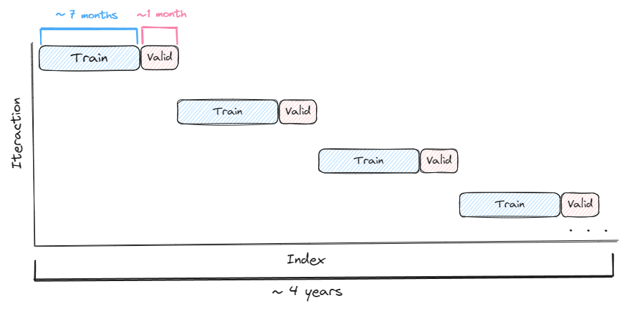

# **Bitcoin price prediction with PySpark**
## Big Data Computing final project - A.Y. 2022 - 2023
Prof. Gabriele Tolomei

MSc in Computer Science

La Sapienza, University of Rome

### Author: Corsi Danilo (1742375) - corsi.1742375@studenti.uniroma1.it


# **Project details**
## **Problem**
The cryptocurrency Bitcoin has attracted the attention of many people in recent years. However, it's price fluctuation can be extremely unpredictable, which makes it difficult to predict when the right time to buy or sell this digital currency will be. In this context, prediction Bitcoin prices can be a competitive advantage for investors and traders, as it could allow them to make informed decisions on the right time to enter or exit the market. In this project, I will analyze some machine learning techniques to understand, through the processing of historical data, how accurately the price of Bitcoin can be predicted and whether this can provide added value to cryptocurrency investors and traders.

## **Dataset**
I chose to collect data on the Bitcoin blockchain using the API of the website Blockchain.org, the most relevant information was retrieved from the last four years to the present day (a period for which there were moments of high volatility but also a lot of price lateralization). The procedure has been made as automatic as possible so that the same periods are considered each time the entire procedure is run. The features taken under consideration were divided into several categories:

- **Currency Statistics**
   - **market-price:** the average USD market price across major bitcoin exchanges.
   - **trade-volume:** the total USD value of trading volume on major bitcoin exchanges.
   - **total-bitcoins:** the total number of mined bitcoin that are currently circulating on the network.
   - **market-cap:** the total USD value of bitcoin in circulation.

- **Block Details**
   - **blocks-size:** the total size of the blockchain minus database indexes in megabytes.
   - **avg-block-size:** the average block size over the past 24 hours in megabytes.
   - **n-transactions-total:** the total number of transactions on the blockchain.
   - **n-transactions-per-block:** the average number of transactions per block over the past 24 hours.

- **Mining Information**
   - **hash-rate:** the estimated number of terahashes per second the bitcoin network is performing in the last 24 hours.
   - **difficulty:** a relative measure of how difficult it is to mine a new block for the blockchain.
   - **miners-revenue:** total value of coinbase block rewards and transaction fees paid to miners.
   - **transaction-fees-usd:** the total USD value of all transaction fees paid to miners. This does not include coinbase block rewards.

- **Network Activity**
   - **n-unique-addresses:** the total number of unique addresses used on the blockchain.
   - **n-transactions:** the total number of confirmed transactions per day.
   - **estimated-transaction-volume-usd:** the total estimated value in USD of transactions on the blockchain.

Later on will be added some new features that could help us predict the Bitcoin price:
*   **Next market price:** represents the price of Bitcoin for the next day (this will be the target variable on which to make predictions)
*   **Rate of change:** indicator that measures the percentage of price changes over a period of time, allows investors to spot security momentum and other trends
*   **Simple Moving Averages:** indicators that calculate the average price over a specified number of days. They are commonly used by traders to identify trends and potential buy or sell signals

All these features will be divided into 3 groups based on their correlation and importance with respect to the market price using the Pearson method and Random Forest Regressor to see the differences according to their use:
* **All:** contains all features
* **Most relevant:** contains features that have a relevance value > 0.5
* **Least relevant:** contains the features that have a relevance value <= 0.5

The whole dataset will be splitted into two sets:
* **Train / Validation set:** will be used to train the models and validate the performances
* **Test set:** will be used to perform price prediction on never-before-seen data (the last 3 months of the original dataset will be used).

## **Methods**
Several types of regression algorithms will be used, including: **Linear Regression**, **Generalized Linear Regression**, **Random Forest Regressor** and **Gradient Boosting Tree Regressor** to see their differences and how they perform in the various stages of training / validation and testing. 

In order to train and validate the model I will try several approaches:
- **Default without normalization:** Make predictions using the chosen base model
- **Default with normalization:** Like the previous one but features are normalized

Then the features that gave on average the most satisfactory results (for each model) are chosen and proceeded with:

- **Hyperparameter tuning:** Researching the best parameters to use
- **Cross Validation:** Validate the performance of the model with the chosen parameters

If the final results are satisfactory, the model will be trained on the whole train / validation set and saved to later make predictions on the test set.

---
For each approach the train / validation set will be split according to the chosen splitting method (in order to figure out which one works best for our problem):

- **Block time series splits:** Involves dividing the time series into blocks of equal length, and then using each block as a separate fold for cross-validation.

   

- **Walk forward time series splits:** Involves using a sliding window approach to create the training and validation sets for each fold. The model is trained on a fixed window of historical data, and then validated on the next observation in the time series. This process is repeated for each subsequent observation, with the window sliding forward one step at a time. 

   

- **Single time series split** Involves dividing the time series considering as validation set a narrow period of time and as train set everything that happened before this period, in such a way as to best benefit from the trend in the short term.

   

## **Evaluation framework:**
Different types of metrics will be used, including: **RMSE (Root Mean Squared Error)**, **MSE (Mean Squared Error)**, **MAE (Mean Absolute Error)**, **MAPE (Mean Absolute Percentage Error)**, **R2 (R-squared)** and **Adjusted R2** to get a complete picture of the performance of the various models.

Since predicting the price accurately is very difficult we will see also how good the models are at predicting whether the price will go up or down. 
For each row in our predictions let's consider the actual market-price, next-market-price and our predicted next-market-price (prediction).
We compute whether each prediction is correct (1) or not (0):

$$ 
prediction\_is\_correct
= 
\begin{cases}
0 \text{ if [(market-price > next-market-price) and (market-price < prediction)] or [(market-price < next-market-price) and (market-price > prediction)]} \\
1 \text{ if [(market-price > next-market-price) and (market-price > prediction)] or [(market-price < next-market-price) and (market-price < prediction)]}
\end{cases}
$$

Then we count the number of correct prediction:
$$ 
correct\_predictions
= 
\sum_{i=0}^{total\_rows} prediction\_is\_correct
$$

Finally we compute the percentage of **accuracy** of the model:
$$
\\ 
accuracy 
= 
(correct\_predictions / total\_rows) 
* 100
$$

# **Project structure**

```
.
├── datasets
│  ├── output
│  │  ├── bitcoin_blockchain_data_15min_test.parquet
│  │  └── bitcoin_blockchain_data_15min_train_valid.parquet
│  ├── raw
│  │  └── bitcoin_blockchain_data_15min.parquet
│  └── temp
│
├── features
│  ├── all_features.json
│  ├── features_relevance.json
│  ├── least_rel_features.json
│  └── most_rel_features.json
|
├── models
│  ├── GeneralizedLinearRegression
│  ├── GradientBoostingTreeRegressor
│  ├── LinearRegression
│  └── RandomForestRegressor
|
├── notebooks
│  ├── 1 - Data crawling.ipynb
│  ├── 2 - Feature Engineering.ipynb
│  ├── 3.1 - [Block Split] Linear Regression.ipynb
│  ├── 3.2 - [Walk Forward Split]  Linear Regression.ipynb
│  ├── 3.3 - [Short Term Split] Linear Regression.ipynb
│  ├── 4.1 - [Block Split] Generalized Linear Regression.ipynb
│  ├── 4.2 - [Walk Forward Split] Generalized Linear Regression.ipynb
│  ├── 4.3 - [Short Term Split] Generalized Linear Regression.ipynb
│  ├── 5.1 - [Block Split] Random Forest Regressoripynb.ipynb
│  ├── 5.2 - [Walk Forward Split] Random Forest Regressoripynb.ipynb
│  ├── 5.3 - [Short Term Split] Random Forest Regressoripynb.ipynb
│  ├── 6.1 - [Block Split] Gradient Boosting Tree Regressor.ipynb
│  ├── 6.2 - [Walk Forward Split] Gradient Boosting Tree Regressor.ipynb
│  ├── 6.3 - [Short Term Split] Gradient Boosting Tree Regressor.ipynb
│  ├── 7 - Final scores.ipynb
│  └── images
│     ├── block-splits.png
│     ├── single-split.png
│     ├── walk-forward-splits.png
│     └── Drawings.excalidraw
|
├── presentation
│  ├── presentation.pptx
│  └── speech.docx
|
├── README.md
|
├── results
│  ├── block_splits
│  │  ├── GeneralizedLinearRegression.csv
│  │  ├── GeneralizedLinearRegression_accuracy.csv
│  │  ├── GradientBoostingTreeRegressor.csv
│  │  ├── GradientBoostingTreeRegressor_accuracy.csv
│  │  ├── LinearRegression.csv
│  │  ├── LinearRegression_accuracy.csv
│  │  ├── RandomForestRegressor.csv
│  │  └── RandomForestRegressor_accuracy.csv
│  ├── final
│  │  ├── final.csv
│  │  ├── final.png
│  │  ├── final_accuracy.csv
│  │  └── final_accuracy.png
│  │ 
│  ├── single_split
│  │  ├── GeneralizedLinearRegression.csv
│  │  ├── GeneralizedLinearRegression_accuracy.csv
│  │  ├── GradientBoostingTreeRegressor.csv
│  │  ├── GradientBoostingTreeRegressor_accuracy.csv
│  │  ├── LinearRegression.csv
│  │  ├── LinearRegression_accuracy.csv
│  │  ├── RandomForestRegressor.csv
│  │  └── RandomForestRegressor_accuracy.csv
│  └── walk_forward_splits
│     ├── GeneralizedLinearRegression.csv
│     ├── GeneralizedLinearRegression_accuracy.csv
│     ├── GradientBoostingTreeRegressor.csv
│     ├── GradientBoostingTreeRegressor_accuracy.csv
│     ├── LinearRegression.csv
│     ├── LinearRegression_accuracy.csv
│     ├── RandomForestRegressor.csv
│     └── RandomForestRegressor_accuracy.csv
│ 
└── utilities
   ├── imports.py
   ├── parameters.py
   └── utilities.py
```

# **Files / folder description**
### **Datasets folder: contains the original, temporary and processed datasets**
- **bitcoin_blockchain_data_15min_test.parquet:** dataset used in the final phase of the project to perform price prediction on never-before-seen data
- **bitcoin_blockchain_data_15min_train_validation.parquet:** dataset used to train and validate the models used
- **bitcoin_blockchain_data_15min.parquet:** original dataset obtained by making calls to the Blockchain.com API

### **Features folder: contains the features used throughout the project**
- **all_features.json:** contains the name of all features
- **features_relevance.json:** contains features name and their relevance value
- **least_rel_features.json:** contains the name of the least relevant features with respect to the price of Bitcoin
- **most_rel_features.json:** contains the name of the most relevant features with respect to the price of Bitcoin

### **Models folder: contains files related to the trained models**
- Each folder **(GeneralizedLinearRegression, GradientBoostingTreeRegressor, LinearRegression and RandomForestRegressor)** contains the trained model with the best parameters, ready to be used to perform price prediction on never-before-seen data

### **Notebooks folder: contains notebooks produced**
- **1. Data crawling.ipynb:** crawling data on bitcoin's blochckain by querying blockchain.com
- **2. Feature Engineering.ipynb:** adding useful features regardings the price of Bitcoin, visualizing data and performing feature selection
- **3 - 6. [<splitting_method>] <model_name>.ipynb:** executing the chosen model, first with default values, then by choosing the best parameters by performing hyperparameter tuning with cross validation and performance evaluation (all with different splitting methods)
- **7. Final scores.ipynb:** display the final scores and making predictions on the test set with the models trained on the whole train / validation set

### **Results folder: contains all results obtained**
- Based on the splitting method, results regarding metrics and accuracy are collected (including the final ones)

### **Utilities folder: contains files defined by me used by most notebooks to reuse the code**

- **imports.py:** contains imports of external libraries
- **parameters.py:** contains the parameters used by the models during the train / validation phase
- **utilities.py:** contains functions that are used by the models during the train / validation phase

# Final results
**RMSE (The lower the better)**

**Accuracy (The higher the better)**

